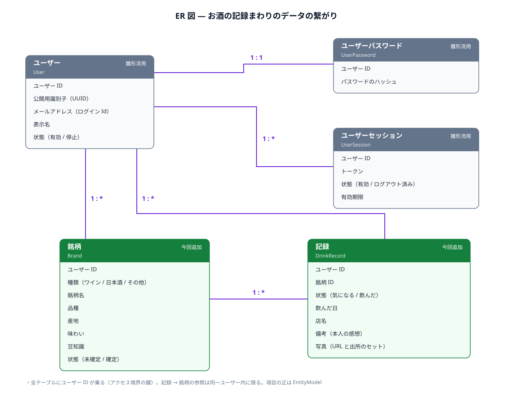
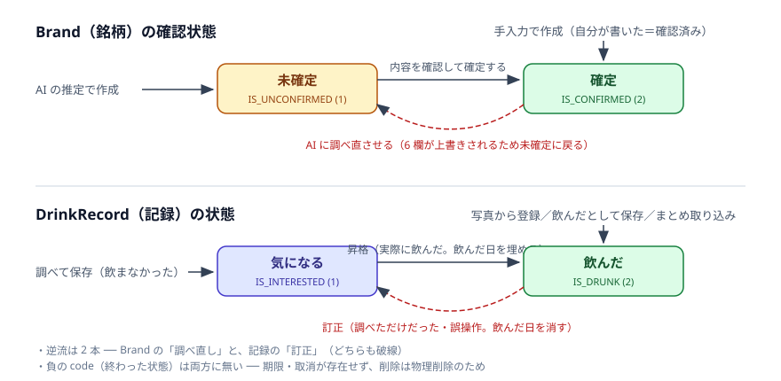

# お酒の記録 — 詳細要件定義

飲んだお酒をその場で調べて記録するアプリの、エンティティモデル設計。要求と業務フローは [`01_requirements.md`](./01_requirements.md)、思考過程は [`02_analysis.md`](./02_analysis.md)。

**前提**（詳細は 01）

- 複数ユーザー前提だが、当面の利用者は 1 人。アクセス境界の鍵は `userId`（全テーブルに乗る）
- 保存は無期限。自動削除なし。削除は本人の個別操作のみ
- 銘柄情報の知識源（AI・検索）は差し替え可能な外部サービス。**推定を返すだけで、何も所持しない**

**エンティティ**

| エンティティ | テーブル | 扱い |
|---|---|---|
| `User` | `user` | **追加**（設計は雛形 Customer 系の読み替え。形は 3 章末尾） |
| `UserPassword` | `user_password` | 追加（同上） |
| `UserSession` | `user_session` | 追加（同上） |
| `Brand` | `user_brand` | **追加** |
| `DrinkRecord` | `user_drink_record` | **追加** |

## 1. 用語 — 全体の用語集に追加する呼称

| 呼称（これで統一する） | 何を指すか | 言い換えない |
|---|---|---|
| 銘柄 | ユーザーごとに育つ酒の情報。AI が下書きし、本人が確認して確定する | 銘柄マスタ、ラベル |
| 記録 | 酒との出会い 1 回分。「気になる」「飲んだ」を状態に持つ | ログ |
| 気になる | 調べたが飲んでいない記録の状態 | お気に入り、ブックマーク、ウィッシュリスト |
| 確定 | 銘柄の内容を本人が確認した状態 | 承認 |
| 豆知識 | AI が調べた、覚える助けになる話 | 蘊蓄、テイスティングノート |
| 備考 | 本人の感想。AI は触れない | 感想欄 |
| 写真 | 記録に付く 1 枚。出所（自分が撮った／知識源が探した）を持つ | 画像 |
| 照会 | 知識源に銘柄情報を問い合わせること。**保存はしない** | ── |
| 検索 | 自分の記録・銘柄を探すこと | 照会と混同しない |
| 昇格 | 「気になる」の記録を「飲んだ」に変えること | ── |
| 訂正 | 昇格の逆（飲んだ → 気になる。飲んだ日は消える） | 降格、キャンセル |
| 付け替え | 記録の参照先を別の既存銘柄に変えること（重複の掃除） | 統合、マージ |

## 2. ER 図

データの繋がりと多重度を示す。項目の正は 3 章の EntityModel。



- ユーザーとパスワードだけ `1:1`（パスワードは 1 人 1 本）。セッションは端末ごとに複数
- 銘柄 `1:*` 記録──同じ銘柄を別の日に飲めば記録が増える。記録 0 件でも銘柄は残る

状態遷移：



## 3. EntityModel

### `Brand`（銘柄）

```scala
package sakelog.user.model

import ixias.core.model.*

/**
 * 銘柄: ユーザーごとに育つ、酒の銘柄情報。
 *
 * AI（知識源）が下書きし、ユーザーが確認・修正して確定する。
 * kind〜trivia の 6 欄が「AI が書ける欄」。再照会するとこの 6 欄は上書きされる。
 */
import Brand.*
case class Brand(
  id:        Option[Id],                             // 管理Id
  userId:    User.Id,                                // ユーザーId（アクセス境界の鍵）
  kind:      Kind,                                   // 種類
  name:      String,                                 // 銘柄名
  variety:   Option[String],                         // 品種（kind が読み方を決める）
  region:    Option[String],                         // 産地
  taste:     Option[String],                         // 味わい
  trivia:    Option[String],                         // 豆知識
  state:     Status,                                 // 確認状態（デフォルトを持たない。経路ごとに明示する）
  updatedAt: LocalDateTime = Now,                    // データ更新日
  createdAt: LocalDateTime = Now                     // データ作成日
) extends EntityModel[Id]

/**
 * 銘柄: 付随する型と処理の定義
 */
object Brand:

  // --[ Type Aliases ]------------------------------------------------
  type Id         = Id.Repr
  type WithNoId   = Entity.WithNoId[Id, Brand]
  type EmbeddedId = Entity.EmbeddedId[Id, Brand]

  // --[ Opaque Values ]-----------------------------------------------
  object Id extends Entity.Id[Long]

  // --[ Value Objects ]-----------------------------------------------
  /**
   * 種類。深く扱うのはワインと日本酒
   */
  enum Kind(val code: Short, val name: String) extends EnumStatus[Short]:
    case IS_WINE  extends Kind(code = 1, name = "ワイン")
    case IS_SAKE  extends Kind(code = 2, name = "日本酒")
    case IS_OTHER extends Kind(code = 3, name = "その他") // 浅く受ける

  /**
   * 確認状態
   */
  enum Status(val code: Short) extends EnumStatus[Short]:
    case IS_UNCONFIRMED extends Status(code = 1) // 未確定（AI の推定のまま）
    case IS_CONFIRMED   extends Status(code = 2) // 確定（ユーザーが確認した）
```

**ここで型が語っていること**

- `name` だけ必須──銘柄は名前さえあれば立つ（手入力の最小形）。品種・産地・味わい・豆知識は AI が埋められなければ空でよい
- `userId` が必須──ユーザーに属さない銘柄は存在しない
- `state` にデフォルトが無い──AI 経路は未確定・手入力は確定と、作る経路ごとに必ず明示させる（デフォルトがあると手入力経路の指定漏れが静かに未確定を作る）

**型では守れない決めごと**

- **`kind` が `variety` の読み方を決める**：IS_WINE ならぶどう品種、IS_SAKE なら米の品種。IS_OTHER では原則使わない
- **AI（照会・再照会）が書けるのは kind / name / variety / region / taste / trivia の 6 欄だけ**。再照会したら `state` を IS_UNCONFIRMED に戻す（内容が本人の見ていないものに変わるため）
- **手入力で作った銘柄は最初から IS_CONFIRMED**（自分が書いた内容＝確認済み）
- **本人の編集は state を変えない。** 未確定 → 確定は明示の確定操作だけ、確定 → 未確定は再照会だけ
- `name` は空文字・空白のみを禁止（唯一の必須文字列で、候補提示の起点になるため）
- **照会が失敗した写真からの登録は、仮の名前（例：「銘柄不明 8/21」）の未確定 Brand で受ける**──圏外や読み取り不能でも写真と記録を残す。後で再照会または手直しする
- 再照会が上書きするのは 6 欄だけ。**写真（記録側にある）は取得し直さない**
- **`(userId, name)` に一意制約は張らない**。重複銘柄は許容し、保存時・確認時の候補提示（と付け替え）で吸収する。統合機能は無い
- **記録が 0 件の銘柄だけ削除できる**。記録が付いている銘柄は消せない
- **`Option` の文字列列に空文字は保存しない**（値が無いなら None）。「無い」の表現を None と `""` の 2 通りにしない

**保存されるデータの例**

| id | userId | kind | name | variety | region | taste | trivia | state |
|---|---|---|---|---|---|---|---|---|
| 1 | 1 | IS_WINE | シャトー・メルシャン 桔梗ヶ原メルロー | メルロー | 長野県 塩尻 | 重すぎず滑らかなタンニン | 桔梗ヶ原は日本メルローの聖地と呼ばれる | IS_CONFIRMED |
| 2 | 1 | IS_SAKE | 風の森 ALPHA 1 | 秋津穂 | 奈良県 御所 | 微発泡で甘やか | 全量無濾過無加水生酒の蔵 | IS_UNCONFIRMED |
| 3 | 1 | IS_OTHER | 私の白猫（果実酒） | | | 甘口 | | IS_CONFIRMED |

（1 行目＝確認済みのワイン。2 行目＝AI 推定のままの日本酒。3 行目＝手入力の「その他」──作成時から確定）

### `DrinkRecord`（記録）

```scala
package sakelog.user.model

import ixias.core.model.*

/**
 * 記録: 酒との出会い 1 回分。
 *
 * 「気になる」（調べたが飲んでいない）も同じモデルの状態違い。
 * 写真は記録に付く（同じ銘柄でも飲むたびに撮る写真は別）。
 */
import DrinkRecord.*
case class DrinkRecord(
  id:          Option[Id],                           // 管理Id
  userId:      User.Id,                              // ユーザーId（アクセス境界の鍵）
  brandId:     Brand.Id,                             // 銘柄Id
  state:       Status,                               // 記録状態
  drankAt:     Option[LocalDate],                    // 飲んだ日（IS_DRUNK で埋まる。不明なら空）
  shopName:    Option[String],                       // 店名（どこで）
  memo:        Option[String],                       // 備考（本人の感想）
  photo:       Option[Photo],                        // 写真（URL と出所のセット）
  updatedAt:   LocalDateTime = Now,                  // データ更新日
  createdAt:   LocalDateTime = Now                   // データ作成日
) extends EntityModel[Id]

/**
 * 記録: 付随する型と処理の定義
 */
object DrinkRecord:

  // --[ Type Aliases ]------------------------------------------------
  type Id         = Id.Repr
  type WithNoId   = Entity.WithNoId[Id, DrinkRecord]
  type EmbeddedId = Entity.EmbeddedId[Id, DrinkRecord]

  // --[ Opaque Values ]-----------------------------------------------
  object Id extends Entity.Id[Long]

  // --[ Value Objects ]-----------------------------------------------
  /**
   * 記録状態
   */
  enum Status(val code: Short) extends EnumStatus[Short]:
    case IS_INTERESTED extends Status(code = 1) // 気になる（調べたが飲んでいない）
    case IS_DRUNK      extends Status(code = 2) // 飲んだ

  /**
   * 写真: URL と出所のセット。片方だけの状態を型で作れなくする
   */
  case class Photo(
    url:    String,     // 参照キー（推測不能なキー。直リンクの静的配信はしない）
    source: PhotoSource // 出所
  )

  /**
   * 写真の出所
   */
  enum PhotoSource(val code: Short) extends EnumStatus[Short]:
    case IS_SELF  extends PhotoSource(code = 1) // 自分が撮った
    case IS_FOUND extends PhotoSource(code = 2) // 知識源が探してきた
```

**ここで型が語っていること**

- `brandId` が必須──銘柄の無い記録は存在しない。手入力でも銘柄（name だけの Brand）を先に作る
- `drankAt` が `Option`──「気になる」（飲んでいない）と、まとめ取り込みで日付が分からない場合の両方を受ける
- 写真は `Option[Photo]`（URL＋出所のセット）──「URL だけ」「出所だけ」という不正な組み合わせは**型で作れない**。「なし」は None

**型では守れない決めごと**

- **`state` が `drankAt` の読み方を決める**：IS_INTERESTED のとき `drankAt` は必ず None。IS_DRUNK では原則埋めるが、取り込み等で不明なら None を許す
- 取り込み・アップロード時、**写真の撮影日時（EXIF）が読めれば `drankAt` の下書きに使う**（未確定なので確定時に直せる。撮影日時は取り込み時点にしか無い情報のため捨てない） 
- 同じ銘柄に「気になる」の記録が複数できることは許容する（昇格はどれを選んでもよい。一意制約は張らない）
- 昇格（IS_INTERESTED → IS_DRUNK）の逆方向は**訂正として許す**（IS_DRUNK → IS_INTERESTED。`drankAt` は None に戻す）。誤操作の救済と、写真から登録して自動で「飲んだ」になった「調べただけの酒」の直しに使う（Q21）
- `Option` の文字列列（店名・備考など）に空文字は保存しない（Brand と同じ規約）
- **1 枚の写真に複数本のボトルが写っていても、1 本分の記録として扱う**（AI 読み取りの運用ルール。切り出しはしない）
- 備考と写真に AI は触れない──これは決めごとではなく、**AI が書ける欄を Brand 側に集めた分割の構造が守っている**

**保存されるデータの例**

| id | userId | brandId | state | drankAt | shopName | memo | photo.url | photo.source |
|---|---|---|---|---|---|---|---|---|
| 1 | 1 | 1 | IS_DRUNK | 2026-08-15 | ビストロ青山 | 彼女と。また頼みたい | /p/a1.jpg | IS_SELF |
| 2 | 1 | 2 | IS_INTERESTED | | 鮨わたなべ | | /p/b2.jpg | IS_FOUND |
| 3 | 1 | 1 | IS_DRUNK | | | | /p/c3.jpg | IS_SELF |
| 4 | 1 | 3 | IS_DRUNK | 2026-07-01 | | 手入力で登録 | | |

（2 行目＝メニューで調べて気になる・写真は知識源。3 行目＝まとめ取り込み直後・日付不明・1 行目と同じ銘柄を参照。4 行目＝手入力・写真なし）

### `User` / `UserPassword` / `UserSession`（雛形の読み替え）

雛形 `Customer` / `CustomerPassword` / `CustomerSession` を **Customer → User に読み替えて流用**する。設計判断は雛形に従い、ここでは形だけ確定させる（雛形にあるハッシュ化・照合などの処理は実装時にそのまま持ってくる）。

```scala
package sakelog.user.model

import ixias.core.model.*

/**
 * ユーザー: 登録されたアカウント。プロフィールのみを持つ。
 */
import User.*
case class User(
  id:        Option[Id],                        // 管理Id
  uuid:      UUID,                              // UUID（公開用の識別子）
  email:     String,                            // ログインId (メールアドレス)
  name:      String,                            // 表示名
  state:     Status        = Status.IS_ACTIVE,  // アカウント状態
  updatedAt: LocalDateTime = Now,               // データ更新日
  createdAt: LocalDateTime = Now                // データ作成日
) extends EntityModel[Id]

object User:

  // --[ Type Aliases ]------------------------------------------------
  type Id         = Id.Repr
  type UUID       = UUID.Repr
  type WithNoId   = Entity.WithNoId[Id, User]
  type EmbeddedId = Entity.EmbeddedId[Id, User]

  // --[ Opaque Values ]-----------------------------------------------
  object Id extends Entity.Id[Long]

  /**
   * 公開用の識別子
   */
  object UUID extends Entity.Id[String]:
    def generate: UUID = UUID(java.util.UUID.randomUUID.toString)

  // --[ Value Objects ]-----------------------------------------------
  /**
   * アカウント状態
   */
  enum Status(val code: Short) extends EnumStatus[Short]:
    case IS_INACTIVE extends Status(code = -1) // 停止
    case IS_ACTIVE   extends Status(code =  1) // 有効
```

```scala
package sakelog.user.model

import ixias.core.model.*
import ixias.core.security.PBKDF2

/**
 * ユーザーパスワード: PBKDF2 ハッシュ。本体から分離して持つ。
 */
import UserPassword.*
case class UserPassword(
  id:        Option[Id],          // 管理Id
  userId:    User.Id,             // ユーザーId
  hash:      String,              // PBKDF2ハッシュ文字列
  updatedAt: LocalDateTime = Now, // データ更新日
  createdAt: LocalDateTime = Now  // データ作成日
) extends EntityModel[Id]

object UserPassword:

  // --[ Type Aliases ]------------------------------------------------
  type Id         = Id.Repr
  type WithNoId   = Entity.WithNoId[Id, UserPassword]
  type EmbeddedId = Entity.EmbeddedId[Id, UserPassword]

  // --[ Opaque Values ]-----------------------------------------------
  object Id extends Entity.Id[Long]
```

```scala
package sakelog.user.model

import ixias.core.model.*
import ixias.core.model.value.Token

/**
 * ユーザーセッション: サーバ側で保持するログインセッション。
 */
import UserSession.*
case class UserSession(
  id:        Option[Id],                        // 管理Id
  userId:    User.Id,                           // ユーザーId
  token:     Token,                             // セッショントークン（未署名）
  state:     Status        = Status.IS_ACTIVE,  // セッション状態
  expiresAt: LocalDateTime = Now.plusDays(30),  // 有効期限
  updatedAt: LocalDateTime = Now,               // データ更新日
  createdAt: LocalDateTime = Now                // データ作成日
) extends EntityModel[Id]

object UserSession:

  // --[ Type Aliases ]------------------------------------------------
  type Id         = Id.Repr
  type WithNoId   = Entity.WithNoId[Id, UserSession]
  type EmbeddedId = Entity.EmbeddedId[Id, UserSession]

  // --[ Opaque Values ]-----------------------------------------------
  object Id extends Entity.Id[Long]

  // --[ Value Objects ]-----------------------------------------------
  /**
   * セッション状態
   */
  enum Status(val code: Short) extends EnumStatus[Short]:
    case IS_CLOSED extends Status(code = -1) // 無効化: ログアウト済み
    case IS_ACTIVE extends Status(code =  1) // 有効
```

**型では守れない決めごと（User 系）**

- `user.email` に一意制約（ログイン Id）。`user.uuid` にも一意制約
- `user_password.userId` に一意制約（User と 1:1。パスワードは 1 人 1 本）
- `user_session.token` に一意制約。セッションは 1 人に複数あってよい（端末ごと）
- **パスワード変更とアカウント停止（IS_INACTIVE）のときは、そのユーザーの全セッションを IS_CLOSED にする**（属性どうしの連動。漏えいしたトークンが最長 30 日生き残るのを防ぐ）
- ゲスト照会の引き継ぎ（Q11）は **UserSession の行とは別物**──ログイン前の一時領域で持ち、業務データのテーブルには書かない（詳細は 5 章「照会と引き継ぎ」）

**保存されるデータの例**

| テーブル | 例 |
|---|---|
| `user`（有効） | id=1, uuid=550e8400-…, email=ueno@example.com, name=かんた, state=IS_ACTIVE |
| `user`（停止） | id=2, uuid=7c9e6679-…, email=test@example.com, name=テスト, state=IS_INACTIVE（ログイン不可。全セッションも失効） |
| `user_password` | id=1, userId=1, hash=pbkdf2:… |
| `user_session`（有効） | id=1, userId=1, token=a3f9…, state=IS_ACTIVE, expiresAt=2026-09-20 |
| `user_session`（ログアウト済み） | id=2, userId=1, token=b7c2…, state=IS_CLOSED, expiresAt=2026-09-18 |

## 4. 区分値の考え方

- 名前は `IS_` 始まり、`code` は正が「生きている」・負が「終わった」の規約に従う。**新規に作った区分値（Kind・Brand.Status・DrinkRecord.Status・PhotoSource）には負の code が 1 つも無い**──期限・取消・失効が要求に存在せず、削除は物理削除のため。「終わった」状態がそもそも生まれない。負を持つのは流用する User 系だけ（`IS_INACTIVE`＝停止、`IS_CLOSED`＝ログアウト済み） 
- 状態を 1 本にせず **Brand（確認状態）と DrinkRecord（記録状態）に 2＋2 で分けた**。「未確定／確定」は銘柄の性質（AI の推定を確認したか）、「気になる／飲んだ」は記録の性質（体験がどうなったか）で、役目が違う。混ぜると「気になるが内容は確認済み」が表せない
- `Kind` が enum である理由：種類が増えたら属性の解釈・画面・AI プロンプトのコードを書くことになる（エンジニアが増やす値）。対して品種・産地は増えてもコードが変わらないので文字列の属性
- `Kind` は業務の人（画面）に見せる区分値なので `name` を持つ（雛形 DiscountType と同じ判断）。`PhotoSource` は `Photo` の中でだけ使う内部区分なので `name` を持たない

## 5. エンティティをまたぐルール

**参照と境界**

- **`DrinkRecord.userId` は参照先 `Brand.userId` と一致**していなければならない（他人の銘柄への参照は境界破り）。このルールと「記録が付いた銘柄は消せない」は**スキーマでも守る**（複合 FK と削除拒否。付録B）
- **写真の配信も userId の照合を通す**。直リンクの静的配信はしない（テーブルだけ守っても、写真が漏れれば境界は破れる）

**銘柄の付け替え（重複の掃除）**

- **確認・確定の場面では、候補提示から記録を既存の銘柄に付け替えられる**（`brandId` の更新。付け替え先も同一 userId に限る）。写真経路とまとめ取り込みは保存時に候補を挟めず毎回新規の銘柄を作るため、これが重複の掃除手段になる
- 付け替えで記録 0 件になった銘柄は削除できる

**削除**

- **削除は連鎖しない**：記録を消しても銘柄は消えない。記録 0 件になった銘柄のみ、本人の操作で削除できる
- 写真ファイルは**記録と 1:1 で所有し、記録間で共有しない**。自前で保存したファイルは、記録の削除・写真の差し替え・アカウントを消す運用のすべてで必ず消す
- アカウントを消す運用（機能としての退会は無い）では、**記録 → 銘柄 → パスワード・セッション → ユーザー**の順に、写真ファイルも含めて消す

**照会と引き継ぎ**

- 照会は**業務データ（銘柄・記録）を書き込まない**（ゲストも記録者も同じ）。**乱用対策のための照会の計数・ログは業務データの外に持ってよい**。公開デプロイはレート制限を前提とする
- ゲスト → ログインの引き継ぎは、**推測不能なトークンを鍵にした短時間の一時領域**で行う。引き継ぐのは**照会結果と撮った写真**。保存完了または期限切れで写真ごと消す
- 知識源へ送るのは銘柄の推定に必要な**写真とテキストだけ**。写真の EXIF（位置情報など）は**除去してから送る**。備考・店名・飲んだ日・ユーザー識別子は送らない（EXIF は除去の前に自分のサーバ内で読み、撮影日時だけ飲んだ日の下書きに使う＝Q20）

**候補提示**

- 「名前が近い」の判定は、記号・空白を除いた部分一致とし、かな・大文字小文字・全半角を吸収する照合で行う（これを決めないと中黒 1 つで候補に出ず、重複が量産される）

## 6. 置き場所（コンテキスト）

**判断：** コンテキストは `user` の 1 つ。5 エンティティすべてがここに入る。

**理由：** 所持物を持つアクターが記録者 1 人だけで、触る人と変更権限が全エンティティで同一。雛形も customer コンテキストに認証系（Password / Session）と業務エンティティ（Cart / StampCard）を同居させており、その型に合わせた。

**採らなかった案：** 認証（udb）と記録（drink）の 2 分割。教材の古い切り方にはあるが、コンテキストの判断軸（触る人・変更権限・画面）で認証と記録は同一人物・同一権限であり、アクターが増えていないのに境界を増やすことになるため却下。

**判断が変わる条件：** アクターが増えたとき（管理者を立てる、共有機能で「見る人」が分かれる）。

---

## 付録A 今回やらないこと

- **ウイスキーほか、ワイン・日本酒以外の種類の深掘り**──「その他」で浅く受ける。2 周目の追加機能候補（種類を 1 つ足して設計が壊れないかの検証を兼ねる）
- **復習クイズなどの学習機能**──振り返りは検索と一覧で足りる
- **銘柄の統合機能**──重複は候補提示で吸収する。誤登録の掃除は「記録 0 件の銘柄の削除」で行う
- **退会（アカウント削除）機能**──必要になったら運用（DB）で消す
- **システム管理者（role・管理画面）**──運用者＝本人。role 列は後から足せる
- **ヴィンテージ（年）の列**──普段行く店では年を気にしない。要るなら name に含める
- **精米歩合・特定名称など種類固有の列**──深さは AI が味わい・豆知識に書く中身で出す
- **共有・公開機能**──記録は本人にしか見えない

## 付録B 判断の記録

### 銘柄を独立エンティティにし、ユーザーごとに持つ

- **判断：** `Brand` を `DrinkRecord` から分離し、`userId` を持たせる（全ユーザー共通のマスタにしない）
- **理由：** 同じ銘柄を別の日に飲んだとき、銘柄情報を 1 箇所で持てる（要求「銘柄の情報は共通」）。共通マスタにすると、他人の編集で自分の記録の表示が変わり「自分の記録は自分にしか見えない」と衝突する。編集権限を裁く管理者も必要になるが、全銘柄をカバーする本部型の運用は個人アプリには途方もないコスト
- **代償：** 同じ銘柄が全ユーザーで重複して保存される（獺祭を 100 人が登録すれば 100 行）
- **判断が変わる条件：** 「みんなで銘柄データベースを育てる」アプリに進化させるとき

### 同じ銘柄の判定（同定）は候補提示＋本人が選ぶ

- **判断：** 自動同定しない。**保存時と確認時**に名前が近い既存の銘柄を候補表示し、本人が「同じ」を選んだときだけ紐づける（確認時は付け替え）。`(userId, name)` の一意制約も張らない
- **理由：** 表記ゆれ（シャトー・マルゴー／Ch. Margaux）の自動一致は誤マージ・誤分裂が静かに起きる。外部コード（JAN）はメニュー照会で使えない。アプリの背骨「AI が下書きし、人が確定する」と同じ型に乗せれば、判定を間違えるのは本人だけで事故が見える
- **代償：** 重複銘柄ができ得る──特に写真経路とまとめ取り込みは保存時に候補を挟めない（撮って終わりを守るため）ので毎回新規で作られる。掃除は「確認時に既存銘柄へ付け替え → 0 件になった銘柄を削除」で行い、自動の統合機能は作らない
- **判断が変わる条件：** 重複が候補提示を実用にならないほど汚し始めたら（統合機能の追加を検討）

### 状態を Brand（確認）と DrinkRecord（体験）に分割

- **判断：** 「未確定／確定」は Brand、「気になる／飲んだ」は DrinkRecord に置く。1 エンティティに 3〜4 状態を積まない
- **理由：** 「未確定／確定」は AI の推定を確認したかという銘柄の性質、「気になる／飲んだ」は体験の進行という記録の性質で、変わる契機が違う。混ぜると「気になるが内容は確認済み」が表現できない。研修の「状態が 5 つを超えたら役目が混ざっている」の手前で分けた
- **代償：** 「未確定の記録」を一覧するには JOIN が要る（記録単体では未確定かどうか分からない）
- **判断が変わる条件：** 記録側にも確認の概念が生まれたら（例：飲んだ日を後から検証する運用）

### 写真は記録に置く（銘柄には置かない）

- **判断：** 写真（`photo`：URL と出所のセット）は `DrinkRecord` の属性
- **理由：** 写真は「あの夜あの店で撮った 1 枚」＝体験の一部で、同じ銘柄でも飲むたびに別。銘柄側に置くと 2 枚目で上書きか 1:* 化が要る。記録の削除と一緒に消えるのも素直。銘柄の一覧に出す写真は最新の記録のものを計算で出せるので保存しない
- **代償：** 銘柄一覧に写真を出すには記録側への問い合わせが要る
- **判断が変わる条件：** 銘柄に「公式の見本写真」（体験の写真とは別物）を持ちたくなったら

### 照会は書き込まない。書くのは保存操作のとき

- **判断：** 知識源への照会（写真・テキスト）は表示だけで、DB には何も書かない。写真からの登録だけは保存を兼ねる
- **理由：** 照会の瞬間に書くと「飲んだでも気になるでもない行」が要り、状態機械が汚れる。ゲストと記録者の「調べる」が同じ振る舞いになり、ログイン引き継ぎとも整合する。店での最小操作（撮って終わり）は写真経路が保存を兼ねることで守る
- **代償：** テキストで調べて何もしなければ結果は消える（もう一度調べ直す。API 呼び出しが 1 回増える）
- **判断が変わる条件：** 照会履歴そのものに価値が出たら（例：調べた回数で好みを分析したくなったら）

### 境界と参照整合はスキーマでも守る（複合 FK と削除拒否）

- **判断：** `user_drink_record (brandId, userId)` から `user_brand (id, userId)` へ複合 FK を張り、記録が付いている銘柄の削除は DB が拒否する（RESTRICT）
- **理由：** 「userId の一致」と「記録が付いた銘柄は消せない」はアプリの規約でも守れるが、セッションは端末ごとに複数を許しているため、別端末の同時操作（片方が 0 件確認 → 削除、もう片方が同じ銘柄へ保存）でチェックがすれ違い得る。宣言的に守れるルールは DB に守らせれば、規約が「破れない構造」になる──業務ルールを if で守る前に、触れない構造にできないか見る、の適用
- **代償：** DDL と ORM の設定がやや複雑になる（複合キー）
- **判断が変わる条件：** FK が張れない構成（シャーディング等）へ移行したら、アプリ層の検査に戻す

### 品種・産地は文字列の属性（マスタにしない）

- **判断：** `variety` / `region` は `Option[String]`。品種マスタ・産地マスタは作らない
- **理由：** 品種は世界に数千あり、増やすのは AI と本人で、増えてもコードは 1 行も変わらない（enum にしない判断基準）。マスタにすると表記ゆれの同定を品種でも引き受けることになる。検索は文字列の部分一致で成立する。データ量も想定規模（数千行）では文字列全部で数 MB＝写真 1〜2 枚分にすぎず、正規化の理由にならない──閉じた集合（種類・状態・出所）は既に Short の区分値にしてあり、文字列で持つのは開いた集合だけ
- **代償：** 「ピノノワール」と「ピノ・ノワール」が別の文字列として保存され、検索で取りこぼし得る（緩和策：入力時に自分の過去値をサジェスト＋AI へ表記を指定。02 の実現方式メモ）
- **判断が変わる条件：** 品種での集計・絞り込みが主要な使い方になったら、または行数が桁で増えてインデックスの太さが効き始めたら（マスタ化して名寄せする）
